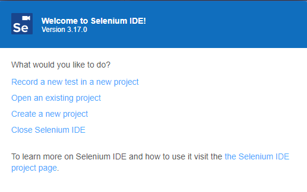
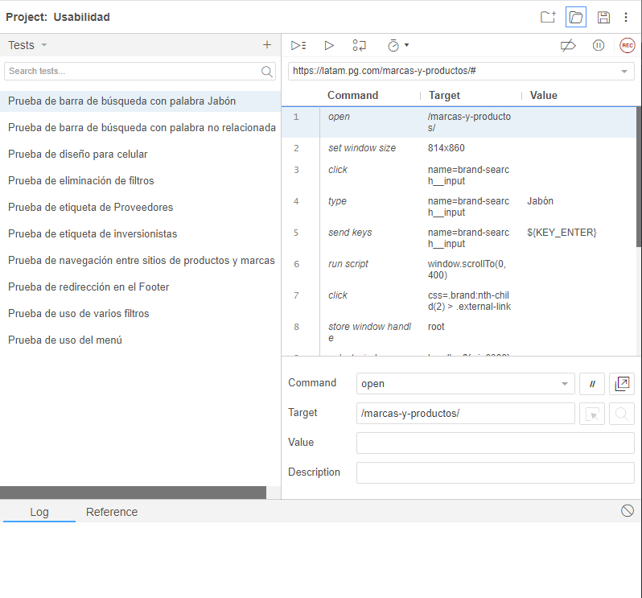
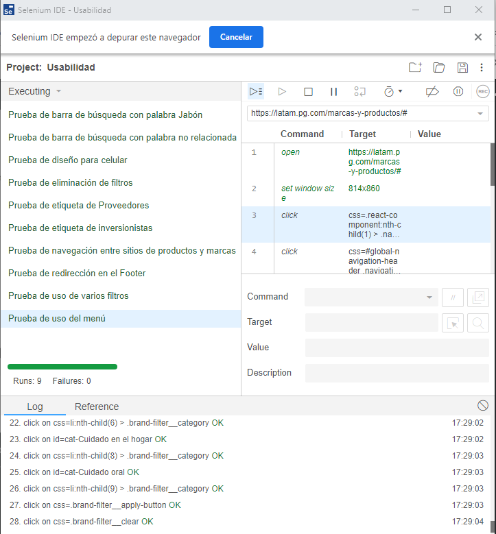

# Pruebas de Aceptación

## [Selenium IDE](https://chrome.google.com/webstore/detail/selenium-ide/mooikfkahbdckldjjndioackbalphokd)

Para ejecutar correctamente las pruebas solo es necesario instalar en Google Chrome una extensión que se encuentra en el link anterior.

Seguidamente solo se debe abrir el IDE y dar click en abrir proyecto existente

Luego se debe abrir seleccionar el archivo que tiene el nombre de `PruebasAceptacion.side` para poder ver las pruebas que se crearon

Seguidamente se puede dar click en cada prueba y ejecutarla por separado o simplemente en el botón de ejecutar todos, para que se ejecuten todas secuencialmente como se muestra a continuación

