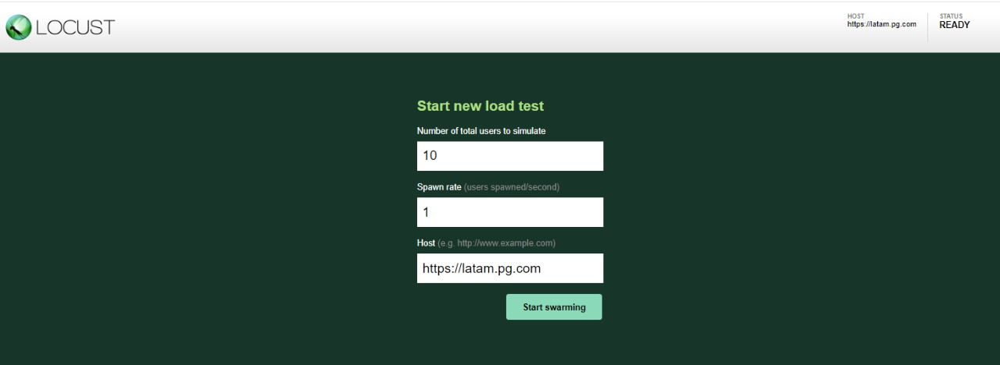
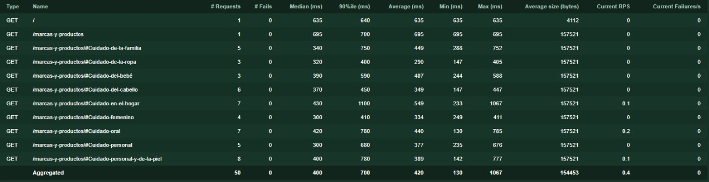
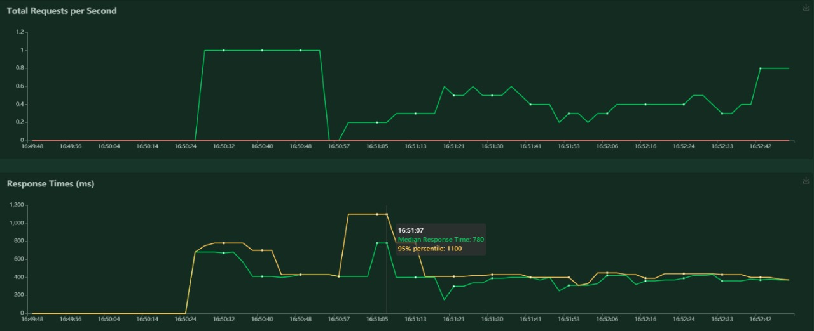

# Pruebas de Carga :bar_chart:

## Pruebas para pagina de Latinoamérica [https://latam.pg.com/](https://latam.pg.com/)

Para ejecutar correctamente las pruebas es necesario tener el lenguaje de programación [Python](https://www.python.org/downloads/) 3.6 o mayor.

 

Seguidamente se debe instalar un paquete de Python que se llama [Locust](https://docs.locust.io/en/stable/) el cual se puede instalar con la siguiente instrucción

```bash
pip3 install locust
```

Cuando ya este instalado el paquete, solo es necesario ejecutar el siguiente código 

```bash
locust -f latam_pg.py
```

Con el código anterior se inicia el servidor con el script  llamado `latam_pg.py`   ahora es necesario abrir en el navegador la dirección [http://localhost:8089/](http://localhost:8089/) donde inicia la prueba



Al entrar al se muestra la interfaz anterior donde se puede probar el sitio con la cantidad de usuarios que se quiera, en la segunda entrada se debe ingresar la cantidad de usuarios que se generan por segundo y en la tercera ya esta por defecto debido a que es parte de la configuración que se realizo en el script `latam_pg.py`  el cual se muestra a continuación

```python
    # Config the host
    host = "https://latam.pg.com"
    wait_time = between(2, 50)

    # Config on FastHttpUser
    connection_timeout = 60.0
    insecure = True
    max_redirects = 5
    max_retries = 1
    network_timeout = 60.0
```

Seguidamente al ejecutar la prueba con `10` usuarios y `1` en la cantidad de generación por segundo, se inician las pruebas que se programaron, en este caso son usuarios que se cargan a la pagina y además de eso visitan algunas paginas o activan los filtros  como se muestra a continuación



Esas son las estadísticas de la prueba que se esta realizando, donde se ve las solicitudes a las pagina, los tiempos de respuesta, si existen errores, entre otros, además para poder visualizar de una mejor manera el comportamiento de la aplicación se pueden observar algunos valores en gráficos, como se muestra en la siguiente imagen

 



Además de ver todos estos datos, en caso de que se requiera, se pueden descargar estos datos y gráficos en diferentes formatos para poder ser procesados en otra ocasión

## Pruebas para pagina de US [https://us.pg.com/](https://us.pg.com/)

Para ejecutar estas pruebas al igual que las anteriores es necesario tener Python y Locust ya instalados previamente, luego es solo de iniciar el servidor con la siguiente instrucción

```bash
locust -f us_pg.py
```

Al igual que las pruebas de la pagina de Latinoamérica es el mismo procedimiento para probar el sitio, la cantidad de usuarios que se quiera, en la segunda entrada se debe ingresar la cantidad de usuarios que se generan por segundo y la tercera ya se encuentra previamente programada.
