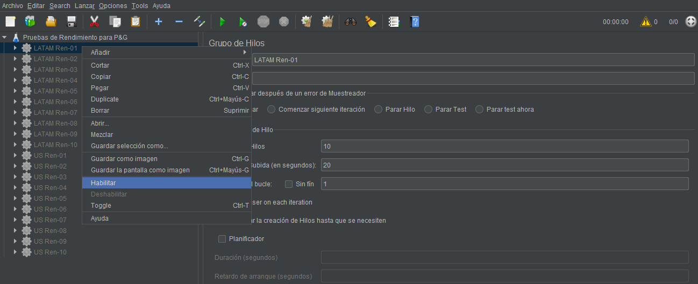

# Rendimiento :runner:

Se plantearon los casos en el mismo proyecto para poder hacer comparaciones sin tener que abrir demasiados archivos, esto también pensando en equipos más limitados en recursos de hardware. 

## Guía de uso para ejecutar las pruebas automatizadas de Rendimiento

1. Debe tener instalado previamente [Jmeter](https://jmeter.apache.org/) para abrir el proyecto *proyecto_pruebas/rendimiento/jmeter_latam_us.jmx*

2. Recuerde habilitar en el proyecto con click derecho únicamente el caso de prueba que desea ejecutar

